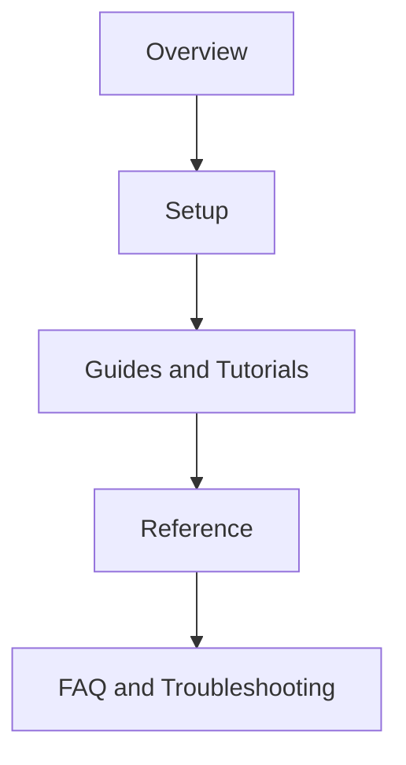

# My View on Good Documentation

My personal view is that documentation is an integral part of any product. Even when a product has an intuitive interface, there always comes a moment when the user thinks, *"Well, I think it's time to open the manual."*

For me, good technical documentation should enhance the overall user experience and help people feel confident while working with the product. Documentation is there to help users understand how to use the product and guide them through confusing or complex situations. It must be clear, structured, and concise - only the information that truly matters. Whenever possible, I like to add visuals such as screenshots, diagrams, and tables. Also, it's vital to highlight key steps so they're easy to spot.

In my work, I've often studied documentation from companies like **[Microsoft](https://learn.microsoft.com/en-us/docs/)**, **Apple**, **GitHub**, and **[Notion](https://www.notion.com/)**. Each has its own style: Microsoft is structured and formal, Notion is conversational and friendly, GitHub is practical. I take the good parts from all of them and use them in my writing.

## Structure

I usually follow this structure:
1. **Overview** - what the product does and who it's for
2. **Setup** - installation, configuration, and first run
3. **Guides and Tutorials** - practical, scenario-based examples  
4. **Reference** - APIs, commands or parameters
5. **FAQ and Troubleshooting** - common mistakes and how to fix them

This structure works because logical navigation and consistent naming allow users to find answers quickly.

## Style and Tone

I prefer to write in plain language, using the active voice and the second person. It's essential to use consistent terminology and keep sentences short to make them easier to understand. The tone should be friendly, but professional.

## Content Quality

Good documentation is very important. If the examples and screenshots are outdated or if the code is broken, users won't trust the product. Any changes to the product must be reflected in relevant documentation.

## Visuals and Formatting

In my opinion, it's necessary to use code blocks, tables, UI screenshots, and diagrams to illustrate complex processes. I also prefer using callouts and highlights to emphasize critical steps. For example:

- ⚙️ Note: optional settings or advanced tips  
- ⚠️ Warning: what can go wrong and how to avoid it 
- ✅ Example: real, working use cases

## Tooling and Maintenance

Maintain docs as code:  
- **Markdown** for portability and Git-based workflows  
- **CI checks** for broken links and formatting

**All in all, good documentation should guide, reassure and save people's time.**
